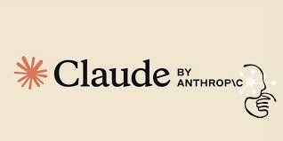
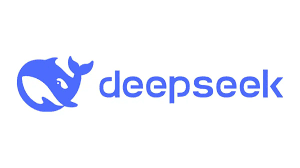
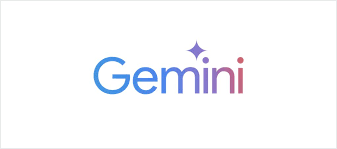
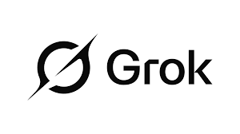
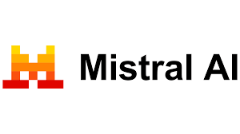
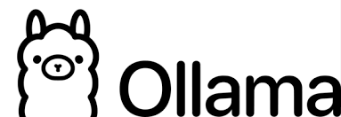

# Agentic AI Quant Researcher

An end-to-end, notebook-based quantitative research lab demonstrating
agentic AI design patterns applied to investment finance, combining
fundamental analysis, technical indicators, and robust backtesting.

---

## Notebook Walkthrough

- [ ] Fundamental analysis (financial ratios, growth, valuation)
- [ ] Technical analysis (EMA5, stochastic, candlestick patterns)
- [ ] Hybrid investment strategies
- [ ] Walk-forward backtesting & risk metrics
- [ ] Agentic AI patterns: routing, parallelization, self-reflection, evaluator–optimizer loops
- [ ] Reproducible, research-grade workflow

---

1. Universe & Data      → Market data + fundamentals ingestion
2. Feature Engineering  → Technical & fundamental signals
3. Strategy Design      → Pure TA, pure fundamentals, hybrid strategies
4. Backtesting          → Walk-forward validation & risk metrics
5. Agentic Evaluation   → Strategy grading & self-reflection loops

---

## Why “Agentic AI”?

Instead of a single monolithic strategy, this project treats quantitative research as a multi-agent process:

- Specialized “workers” generate signals and strategies
- An evaluator scores robustness and risk
- Self-reflection guards against common research pitfalls

---

Later phases will re-implement these workflows using LangGraph, CrewAI, and other agent frameworks.

## Tech Stack

- [x] Python
- [x] Pandas
- [x] NumPy
- [x] Matplotlib
- [x] Scikit-learn
- [x] Jupyter Notebook
- [x] LangGraph
- [x] CrewAI
- [x] Multi-Agent LLMs

## LLM Models

</img>
</img>
</img>
</img>
</img>
</img>
</img>
</img>

- [x] Open AI
- [x] Google Gemini
- [x] Mistral
- [x] Deepseek
- [x] Anthropic Claude
- [x] Ollama
- [x] Groq
- [x] Grok

##### Disclaimer

This project is for research purposes only and does not constitute financial advice.
